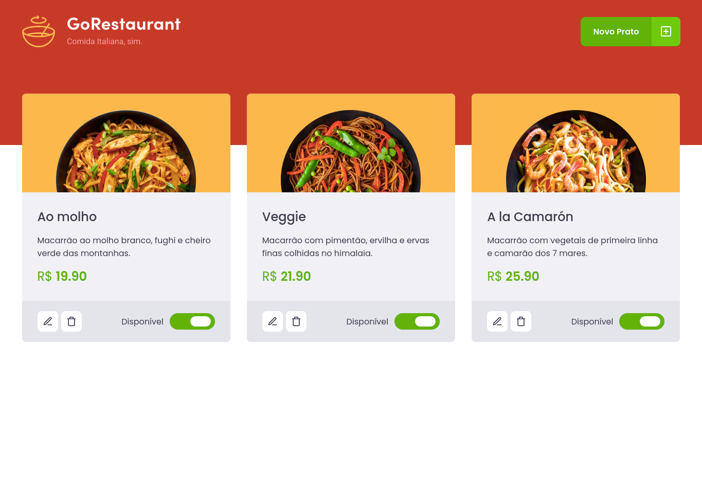
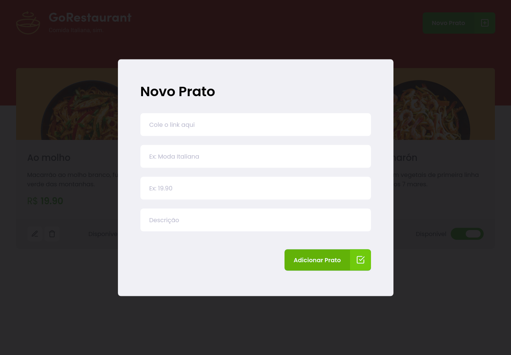

<h1 align="center">
 
Rocketseat - GoStack 11 - Challenge 09
</h1>

This project was created to solve a challenge requested by Rocketseat.
Gostack is immersive training in technologies, react and react natively.

  

  
  

## API

This project connects with API available in [here](https://github.com/rubensojunior/gostack11-desafio-05)

## Layout

This application has a layout that you can follow to be able to visualize its operation.

The layout can be accessed through the Figma page, at [here](https://www.figma.com/file/1lK6AVCPybtWeBLCH8B08N/GoRestaurant?node-id=0%3A1).

## Features

- ⚛️ **React Js** — A JavaScript library for building user interfaces

- **`List your API's food dishes`**

- **`Add new food dishes to your API`**

- **`Edit food dishes from your API`**

- **`Remove food dishes from your API`**

- **`Availability of your API's food dishes`**: On your Dashboard page you must change the availability of a food dish by clicking on the switch which is controlled by the value of `available`.

### Tests

- **`should be able to list all the food plates from your api`**

* **`should be able to add a new food plate`**

- **`should be able to edit a food plate`**

- **`should be able to remove a food plate`**

- **`should be able to update the availibility of a food plate`**

## Getting started

- Clone project > enter the project folder
- run `yarn`
- run `yarn start`

## License

This project is licensed under the MIT License - see the [LICENSE](https://opensource.org/licenses/MIT) page for details.

---

Created with passion by me 👨🏻‍💻
